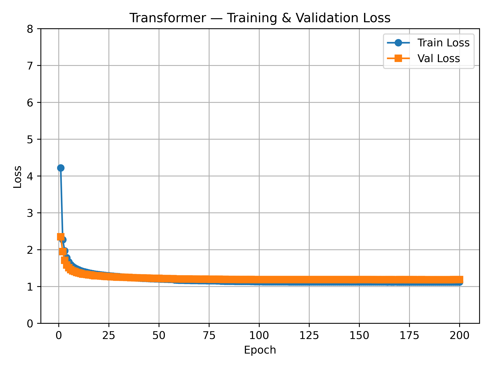
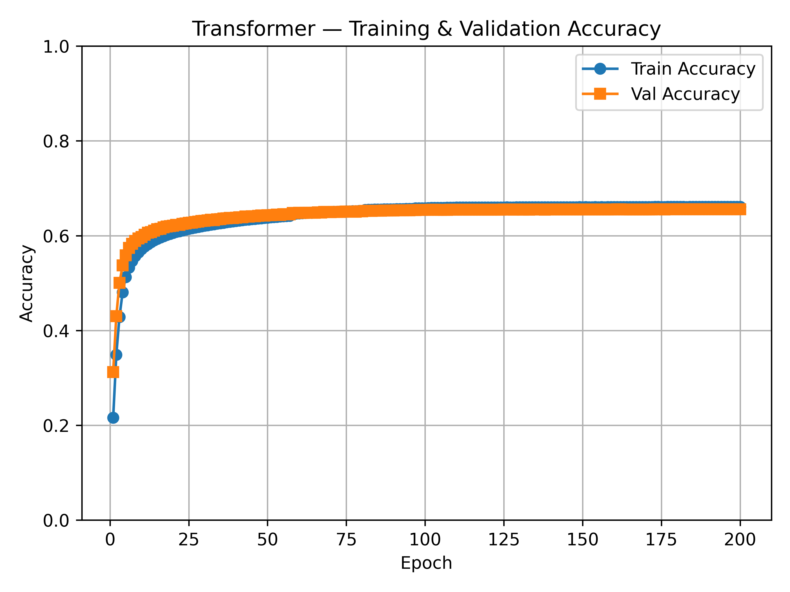

# Transformer Language Model

Character-level GPT-style Transformer language model trained on WikiText-2.

Part of a four-model study comparing recurrent and attention-based architectures on character-level language modeling. Each model is implemented from scratch in PyTorch and trained under identical conditions on the same dataset.

| Model | Val Accuracy | Val Loss | Parameters |
|-------|-------------|----------|------------|
| [RNN](https://github.com/apalapramanik/RNN) | 60.80% | 1.31 | 525K |
| [LSTM](https://github.com/apalapramanik/LSTM) | 61.78% | 1.28 | 1.3M |
| [GRU](https://github.com/apalapramanik/GRU) | 62.05% | 1.26 | 1.1M |
| **Transformer** (this repo) | **65.59%** | **1.19** | **5.0M** |

---

## Results

**200 epochs · char-level · WikiText-2 · NVIDIA H200**

| Metric | Value |
|--------|-------|
| Validation accuracy | **65.59%** |
| Validation loss | 1.19 |
| Parameters | 4,998,400 |




**Sample output** (greedy decoding, prompt: `"The history of"`):
```
The history of the community of the Communist Party , which was also a
professional community in the United States .
```

---

## Architecture

```
tokens → token embedding (256-dim)
       → sinusoidal positional encoding
       → dropout (0.1)
       → 6 × Transformer blocks
       → layer normalization
       → output head (tied to embedding weights)
       → next-character prediction
```

### Transformer Block

Each block applies:
1. Multi-head causal self-attention (8 heads, attention dropout)
2. Residual + LayerNorm
3. Feed-forward network: Linear → GELU → Dropout → Linear
4. Residual + LayerNorm

| Hyperparameter | Value |
|---|---|
| Embedding dim | 256 |
| Attention heads | 8 |
| Head dim | 32 |
| Transformer layers | 6 |
| Feed-forward dim | 1024 (4× embed) |
| Dropout | 0.1 |
| Sequence length | 128 chars |
| Batch size | 128 |
| Optimizer | Adam (lr=3e-4, weight decay=1e-5) |
| Scheduler | ReduceLROnPlateau (factor=0.5, patience=2, min_lr=1e-5) |
| Epochs | 200 |

**Weight tying:** the output projection shares weights with the token embedding, reducing parameters by ~260K and aligning the output space with the input embedding space.

**Training infrastructure:** Trained on an NVIDIA H200 GPU via SLURM on a university HPC cluster (~2 hours for 200 epochs).

---

## Repository Structure

```
Transformers/
├── train.py                  # Training script
├── requirements.txt          # Dependencies
├── checkpoints/
│   └── epoch_200_end.pt      # Trained model weights
├── loss_curve_trans.png      # Training/validation loss
├── accuracy_curve_trans.png  # Training/validation accuracy
├── data/
│   └── wikitext-2-raw/
│       ├── wiki.train.raw
│       ├── wiki.valid.raw
│       └── wiki.test.raw
└── src/
    ├── dataset.py            # CharDataset
    └── model/
        ├── attention.py          # scaled_dot_product_attention, causal_mask
        ├── multi_head_attention.py
        ├── transformer_block.py
        ├── positional_encoding.py
        └── transformer_model.py
```

---

## Dataset

**WikiText-2 (raw)** — character-level language modeling.

| Split | Size |
|---|---|
| Training | ~12M characters |
| Validation | ~1M characters |
| Vocabulary | ~1,013 unique characters |

Each sample is a 128-character window; consecutive windows are non-overlapping (stride = seq_len).

Download with the Hugging Face `datasets` library:

```python
from datasets import load_dataset
import os

dataset = load_dataset("wikitext", "wikitext-2-raw-v1")
os.makedirs("data/wikitext-2-raw", exist_ok=True)

for split, fname in [("train", "wiki.train.raw"), ("validation", "wiki.valid.raw"), ("test", "wiki.test.raw")]:
    with open(f"data/wikitext-2-raw/{fname}", "w") as f:
        f.write("\n".join(dataset[split]["text"]))
```

---

## Installation

```bash
python3 -m venv venv
source venv/bin/activate
pip install -r requirements.txt
```

---

## Training

```bash
python train.py
```

The script resumes automatically from the latest checkpoint in `checkpoints/` if one exists.

During training it prints per-batch loss, saves checkpoints at mid-epoch and end-of-epoch, generates a short text sample each epoch, and saves loss/accuracy plots on completion.

---

## Loading the Trained Model

```python
import torch
from src.dataset import CharDataset
from src.model.transformer_model import TransformerLanguageModel
from src.model.attention import causal_mask

with open("data/wikitext-2-raw/wiki.train.raw") as f:
    train_text = f.read()

dataset = CharDataset(train_text, seq_len=128, stride=128)

model = TransformerLanguageModel(
    vocab_size=dataset.vocab_size,
    embed_dim=256,
    num_heads=8,
    num_layers=6,
    ff_hidden_dim=1024,
    dropout=0.0,
)
ckpt = torch.load("checkpoints/epoch_200_end.pt", map_location="cpu", weights_only=False)
model.load_state_dict(ckpt["model_state"])
model.eval()

# Inference
text = "The market"
indices = [dataset.stoi[c] for c in text]
x = torch.tensor(indices).unsqueeze(0)
mask = causal_mask(x.size(1), device="cpu")
with torch.no_grad():
    logits = model(x, mask)
next_char = dataset.itos[logits[0, -1].argmax().item()]
```

---

## Requirements

- Python ≥ 3.10
- CUDA-capable GPU recommended
- See `requirements.txt` for full dependency list
